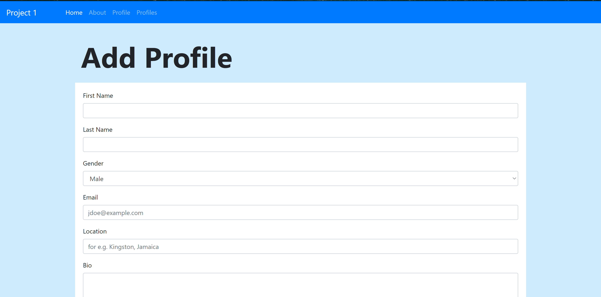

# Project 1

## Set-Up 
* python -m venv venv  (To create environment)
* .\venv\Scripts\activate  (To activate environment. This is for windows)
* pip install -r requirements.txt 
* python run.py

### A simple Flask project that allows users to fill out a form which will add a profile to a database. All profiles in the database can be viewed in the profile tab.

{:height="50%" width="50%"}

